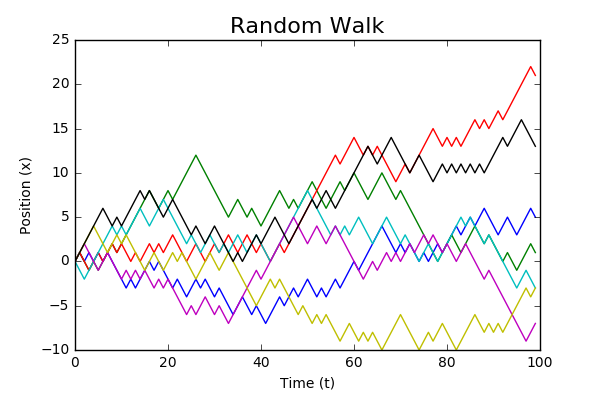
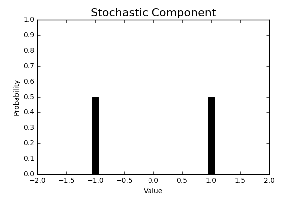

Attempt 1

Megan Crawford

https://github.com/Spiracular/Resume

# 
Bayesian Inference of Phylogeny

with RevBayes

## Table of Contents

1. Introduction: What is This?
    - Definitions (ex: Phylogeny, Genetics, Evo, RevBayes)
    - What I'm trying to do here
1. Quick intro to Cynipidae(w/ pics and explanation of initial base paper)
1. Bayesian MCMC with genomic sequences
1. Model specification (w/ mix of pictures, code, and pseudocode)
    - Full introduction to RevBayes
1. Differing Evolution Model Assumptions

## Introduction

I will start by defining some phylogenetic terms.

**Phylogenetics:** The study of evolutionary relationships between species, which for my purposes is defined in terms of shared-ancestry divinable from genetic analysis. Findings are often expressed as a phylogenetic tree.

**Phylogenetic Tree:** A nestled data structure whose root node can be thought of as the hypothesised last common ancestor between all species analysed, and whose leaf nodes indicate modern-day species. The closest shared node between two species is an indication of how recently they separated to go down different evolutionary paths, relative to other members of the tree in the same clade.

**Clade:** All species that derived from a particular common ancestor.

**Monophyletic Clade:** A clade specification that includes all of the species that derived from the ancestor specified, and includes no species that are not from that ancestor's lineage. An ideal to which cladistic analysis aspires.

# Describe Procedure

### Markov Chain

A Markov Chain models a process that changes (evolves) over time in a fashion that is partially determined by the last read, and partially determined by a randomized draw from a defined distribution.

I'll walk you through a trivial example of a Markov Chain to give you a feel for how this works, before going on to a more complicated model that we use to navigate the hypothesis space of evolutionary models and phylogenetic trees.

A very simple example of a Markov Chain is a "Random Walk."

$$x_{t+1} = x_{t} + \{1,-1\}$$

The position $x$ of a Markov Chain at time $t$ is partially determined by its value at $t-1$, and partially determined by a draw from a distribution called a *Probability Density Function* which defines the probabilities at each possible value. In this very simple case, we used a discrete distribution that had &#189; odds of picking 1, and &#189; odds odds of picking -1.

Typically, though, this will instead be draws from a continuous distribution such as a Normal Distribution $N(m, \sigma)$, or a matrix representing transition-probabilities conditioned on the current value of $x$.

**Probability Density Function:** A distribution that defines the probability for each possible value such that they sum to a probability of 1.

$$\int PDF(x)dx = 1$$

It is not influened by  by earlier time reads. For this reason, people call the procedure "memoryless."

### Markov Chain Monte-Carlo (MCMC)

### Metropolis-Hastings MCMC

[Wikipedia on Metropolis-Hastings Algorithm](https://en.wikipedia.org/wiki/Metropolis%E2%80%93Hastings_algorithm)

Summary: Scale the likelihood of taking moves by their relative values across a complex probability distribution by their relative values.

$g(x'|x_t)$

- If the new proposed point $x'$ has a better likelihood than the current point $x_t$, make the move.
- If the new proposed point $x'$ has worse odds than $x_t$, make that move with probability $f(x')/f(x_t)$

Limitation this imposes on $Q$: g must be symmetric. $g(x|y) = g(y|x)$

## Nucleotide Substitution Model

Each DNA nucleotide has 4 possible values: A, C, G, T.

Conditioning on the a nucleotide state at time $t$, there are 4 discrete possible values for that point at time $t+1$ whose probabilities should sum to 1.

It follows that there are $4^2=16$ possible 1-nucleotide substitutions (including the stable-state, ex: $A \rightarrow A$).

We can represent what we know about substitution rates in the absensce of evolution as a 4-by-4 matrix $Q$, which we dub the *Nucleotide Transition Rate Matrix*. When we condition on the current nucleotide at time $t$, we obtain a set of 4 probabilities summing to 1 from $Q$ that represent our the stochastic element of this Markov Chain.

We can represent this 

To run a Markov Chain 

, dubbed $Q$.

## Bayesian MCMC with Genomes

Bayes Rule:

$$P(\theta|X) = \dfrac{P(X|\theta)P(\theta)}{P(X)}$$

This can also be expressed in the following way:

$$P(\theta|X) = \dfrac{P(X|\theta)P(\theta)}{\sum(P(X|\theta)P(\theta)))}$$

Where...

$X = Observations$

$\theta = Hypothesis$

The denominator of this function is known as the *Marginal Likelihood*. The marginal likelihood represents the probability of the observed result under all hypotheses, and is computationally expensive to approximate well.

Metropolis Hastings Markov Chain Monte Carlo

### Bayesian Inference of Phylogeny

with RevBayes

